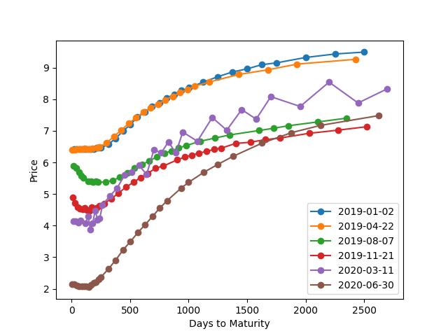

# Benvindo à documentação do projeto

## Notícias políticas

### Volume diário de notícias no portal G1

### Volume diário de notícias no portal Estado de Minas

## Taxas de juros

### Taxa de juros imediata

### Preços dos contratos futuros para cada dia da amostra

### Preços dos contratos futuros para 6 dias igualmente espaçados da amostra

## Estrutura a termo da taxa de juros

### Estrutura a termo da taxa de juros estimada pelo modelo de Vasicek

### Volatilidade condicional de cada vencimento da estrutura a termo da taxa de juros

## Causalidade das notícias políticas sobre a volatilidade condicional de cada vencimento da estrutura a termo da taxa de juros

### P-valor do teste de Granger causalidade (até 40 lags) para cada vencimento da estrutura a termo

